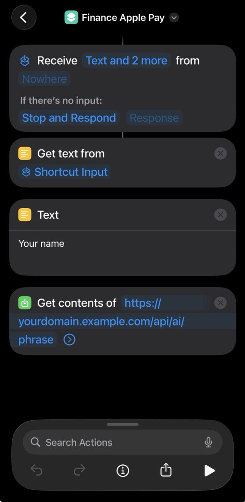
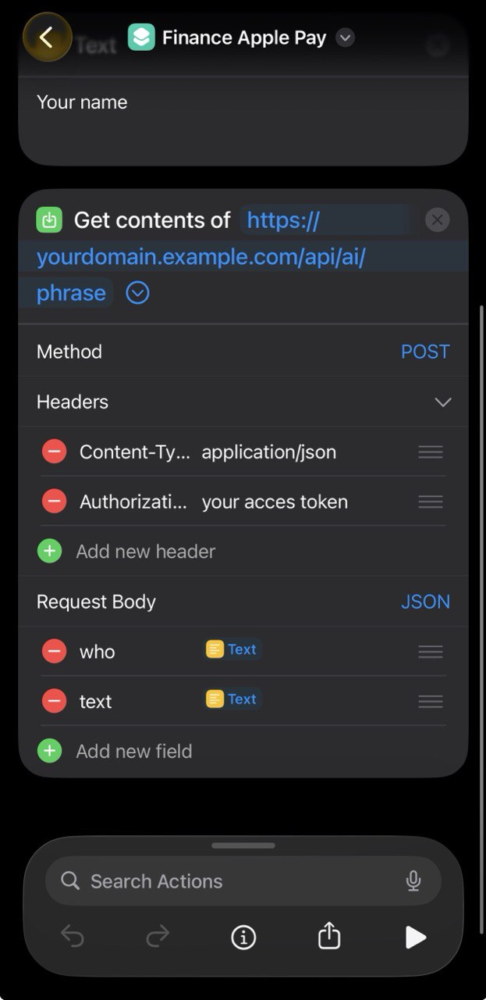
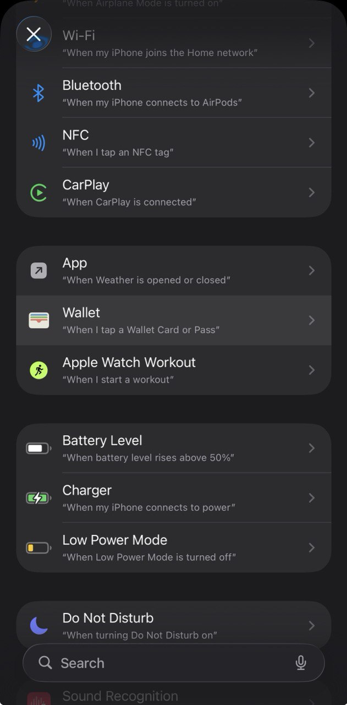
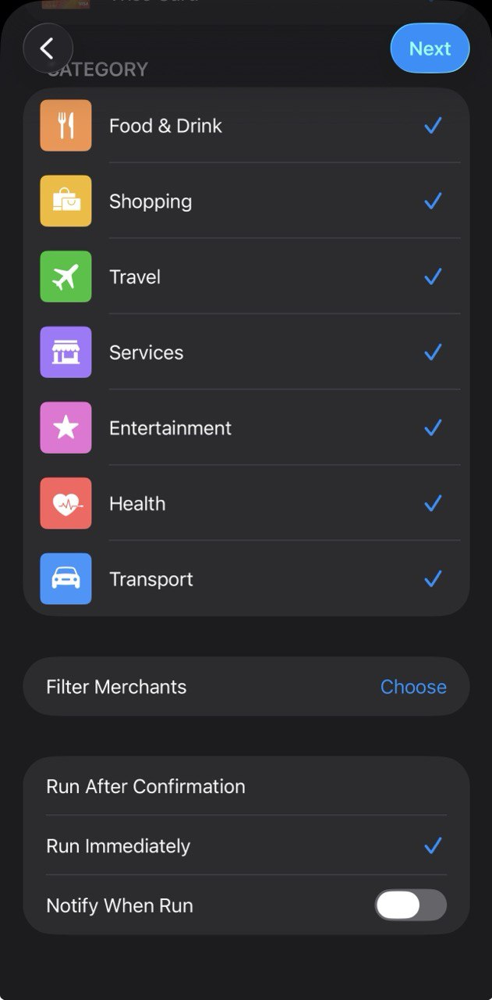
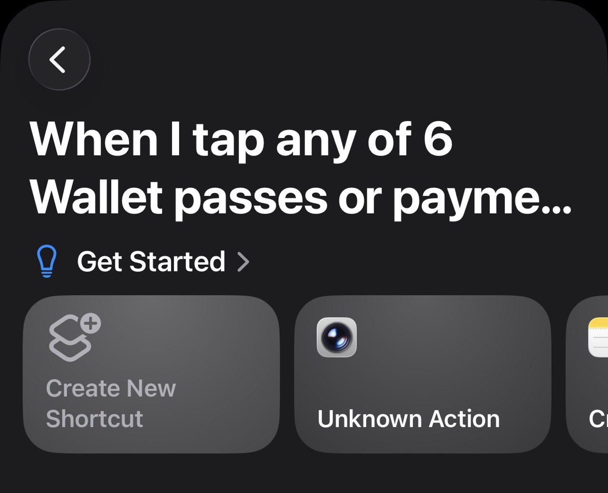
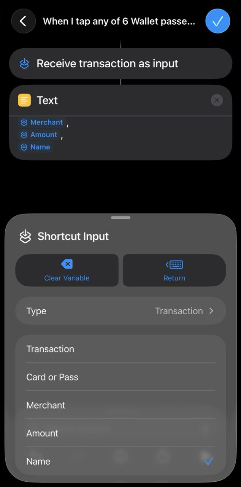

# Home Assistant Add-on - Finance Dashboard

Finance Dashboard brings a lightweight, local-first personal finance app to Home Assistant. It combines a responsive web UI, multi-currency analytics, AI voice/iOS automations, Apple Pay hooks, push notifications, and optional Google Drive backups. This document is the canonical guide for installation, configuration, and automation.

## Table of contents

1. [Installation](#installation)
2. [Using the dashboard](#using-the-dashboard)
3. [Configuration reference](#configuration-reference)
   - [Credentials & security](#credentials--security)
   - [Storage & persistence](#storage--persistence)
   - [AI configuration](#ai-configuration)
   - [Web push notification options](#web-push-notification-options)
   - [Google Drive backup options](#google-drive-backup-options)
4. [Automations & Shortcuts](#automations--shortcuts)
   - [Voice input shortcut](#voice-input-shortcut)
   - [Apple Pay automation](#apple-pay-automation)
5. [Google Drive backups](#google-drive-backups)
   - [Quick setup](#quick-setup)
6. [Web push notifications](#web-push-notifications)
7. [Data persistence](#data-persistence)
8. [Support & troubleshooting](#support--troubleshooting)

---

## Installation

1. **Add the repository**
   - Go to **Settings -> Add-ons -> Add-on Store** in Home Assistant.
   - Click the menu (three dots) -> **Repositories**.
   - Add `https://github.com/kirillkpts/kkhaaddons`.

2. **Install the add-on**
   - Select **Finance Dashboard** from the store and click **Install**.
   - Home Assistant builds the Docker image from source for your architecture (`amd64`, `aarch64`, or `armv7`). No external image download is required.

3. **Configure**
   - Open the add-on after installation.
   - Set up admin credentials, session secret, access token, and any optional AI/backup settings.

4. **Start & use**
   - Click **Start**.
   - Use **Open Web UI** or browse to `http://homeassistant.local:3000`.

## Using the dashboard

1. Sign in with the admin credentials (or any `auth_users` entry).
2. Add transactions manually, via AI/voice, or with Apple Pay automations.
3. Switch between languages (English/Russian), categories, and currencies.
4. Review analytics, charts, and USD conversion insights.
5. Configure notifications, scheduled backups, and API tokens from the settings screen.

Features at a glance:

- Multi-currency tracking with automatic USD conversion.
- Rich filters (date, category, transaction type).
- WebSocket-powered live updates in the UI.
- Installable PWA with offline cache + push notifications.
- AI-powered parsing of natural language input such as "Bought coffee for 5 euros yesterday."

## Configuration reference

All options live in the add-on configuration panel (Supervisor -> Finance Dashboard -> Configuration) and are stored in `/data/options.json`.

### Credentials & security

| Option | Description | Default |
| --- | --- | --- |
| `admin_user` / `admin_pass` | Primary credentials for the web UI. Both fields must be populated before exposing the dashboard. | `""` |
| `auth_users` | Optional comma-separated list of extra `user:password` pairs (e.g. `anna:hunter2,mark:sup3rsecret`). | `""` |
| `session_secret` | Random string for encrypting Express sessions. Generate a long unique value. | `"change_this_secret"` |
| `access_token` | Bearer token required when calling the REST API (`Authorization: Bearer <token>`). Useful for Shortcuts and external automations. | `""` |

### Storage & persistence

| Option | Description | Default |
| --- | --- | --- |
| `session_store_path` | Directory that stores persistent session files. | `"/data/sessions"` |
| `db_path` | Absolute path to the SQLite database. | `"/data/finance.db"` |
| `user_settings_path` | Path to the JSON file that stores UI preferences, selected language, etc. | `"/data/user-settings.json"` |
| `backup_config_path` | Location of backup metadata/state. | `"/data/backup-config.json"` |

`run.sh` automatically creates the directories for these files before launching `server_local.js`.

### AI configuration

| Option | Description | Default |
| --- | --- | --- |
| `ai_provider` | `disabled`, `gemini`, or `openai`. When disabled, AI endpoints and iOS automations expect fully structured JSON. | `"disabled"` |
| `gemini_api_key` | Google Gemini API key, required when `ai_provider: gemini`. | `""` |
| `gemini_model` | Gemini model identifier (`gemini-2.0-flash`, `gemini-2.0-flash-exp`, `gemini-1.5-flash`, `gemini-1.5-flash-8b`, `gemini-1.5-pro`). | `"gemini-2.0-flash"` |
| `openai_api_key` | OpenAI API key, required when `ai_provider: openai`. | `""` |
| `openai_model` | OpenAI model identifier (`gpt-4o`, `gpt-4o-mini`, `gpt-4-turbo`, `gpt-4`, `gpt-3.5-turbo`). | `"gpt-4o-mini"` |

How AI works:

- Voice Shortcut -> dictation or Apple Pay text -> `/api/ai/phrase`.
- Selected model extracts amount, currency, categories, date, and description.
- Transactions are inserted instantly and synchronized to the UI.
- Works in English and Russian out of the box.

### Web push notification options

| Option | Description |
| --- | --- |
| `vapid_public_key` | Public VAPID key. Generate via any Web Push/VAPID generator. |
| `vapid_private_key` | Paired private VAPID key. Keep it secret. |

Notes:

- Push notifications require the dashboard to be installed as a PWA (Add to Home Screen/Springboard).
- iOS allows push for PWAs that are pinned to the lock screen/home screen and opened at least once.

### Google Drive backup options

| Option | Description |
| --- | --- |
| `backup_script_url` | HTTPS endpoint of your deployed Google Apps Script Web App. Leave blank to disable automatic backups. |
| `backup_run_time` | Daily execution time in `HH:MM` (24-hour) format. |

`google-apps-script.js` inside this repository is a ready-made Apps Script handler that saves uploaded database blobs to Drive and exposes helper endpoints (list/delete/download). Follow the steps in [Google Drive backups](#google-drive-backups) to deploy it.

> The add-on does **not** load `google-apps-script.js` automatically. Open the file locally, copy its entire contents, and paste them into the Apps Script editor as described below whenever you need Google Drive backups.

## Automations & Shortcuts
Create voice/iOS flows that post structured payloads to the API so expenses land in the database instantly.

### Voice input shortcut

1. Open Apple Shortcuts and create a new shortcut.
2. Add **Dictate Text** -> choose your preferred language. This produces a `Dictated Text` variable.
3. (Optional) Add a **Text** action to store your name/user ID if you want to populate the `who` field.
4. Add **Get Contents of URL** with the following settings:
   - URL: `https://YOUR_DASHBOARD_URL/api/ai/phrase`
   - Method: `POST`
   - Headers: `Content-Type: application/json`, `Authorization: Bearer YOUR_ACCESS_TOKEN`
   - Request Body (JSON):
     ```json
     {
       "text": "Dictated Text",
       "who": "Your Name"
     }
     ```
5. Save the shortcut and assign a Siri phrase so you can say "Add expense" and dictate the transaction.

### Apple Pay automation

Apple's Wallet app can trigger automations after each transaction. Combine it with the voice shortcut above:

1. Create the voice shortcut described earlier.
2. In Shortcuts, open the **Automation** tab -> **New Automation** -> **Wallet**.
3. Choose **All Cards** (or pick specific ones) and enable the categories you want to monitor. Toggle **Run Immediately**.
4. Tap **Next**, then **Add Action** -> **Text**. Insert the Wallet inputs (`Merchant`, `Amount`, `Name`) in any format you prefer.
5. Add **Run Shortcut** and select the voice shortcut you created in step 1-5. Pass the Text output as input.
6. On the first transaction you will need to unlock the phone and accept any permission prompts.

Reference screenshots:

 

 

 

Tips:

- Keep the `Authorization` header exactly as configured in the add-on.


## Google Drive backups
Finance Dashboard can push encrypted SQLite backups to Google Drive once per day.

### Quick setup

1. Create a Drive folder to store backups and copy the folder ID from the URL.
2. Visit [script.google.com](https://script.google.com), create a project, delete the default `function myFunction() {}` stub, and paste the full contents of [`google-apps-script.js`](google-apps-script.js) into the editor.
3. Replace both `'your-folder-id-here'` placeholders with your folder ID.
4. Click **Deploy -> New deployment**, choose **Web app**, execute as *Me*, and grant access to *Anyone*.
5. Copy the deployment URL into the add-on option `backup_script_url`.
6. (Optional) Adjust `backup_run_time` and `backup_config_path`.
7. Restart the add-on. It will call the Apps Script endpoint each day with a base64-encoded database blob.

## Web push notifications
Enable real-time alerts directly in the PWA or browser.

1. Generate a VAPID key pair (for example via https://vapidkeys.com/ or `web-push generate-vapid-keys`).
2. Paste the public and private keys into the add-on configuration.
3. Restart the add-on.
4. From the dashboard UI, enable push notifications and grant permission in the browser/PWA.

Notifications are dispatched when automation rules fire (e.g. new expense created). iOS requires the dashboard to be installed as a PWA.


## Data persistence
Reference paths for all long-term storage handled by the add-on.

- Database: `db_path` (default `/data/finance.db`)
- User preferences: `user_settings_path` (default `/data/user-settings.json`)
- Session files: `session_store_path` (default `/data/sessions`)
- Backups/meta: `backup_config_path` (default `/data/backup-config.json`)

Because everything lives under `/data`, Home Assistant preserves your data across add-on restarts and updates.


## Support & troubleshooting
Where to look when something goes wrong.

- Review the [changelog](CHANGELOG.md) for recent fixes.
- Search or open an issue on GitHub: https://github.com/kirillkpts/kkhaaddons/issues
- Double-check file permissions under `/data` if the dashboard cannot write backups or the database.
- If AI automations fail, confirm that the selected provider has a valid API key and that the model name matches an allowed value.
- Enable browser dev-tools console/logs to inspect push notification permission errors.

Need help? Open an issue and describe:

- Home Assistant version & hardware architecture.
- Exact error message/log excerpt from the add-on log.
- Steps to reproduce (voice input payload, Apple Pay shortcut, etc.).

Happy budgeting!
